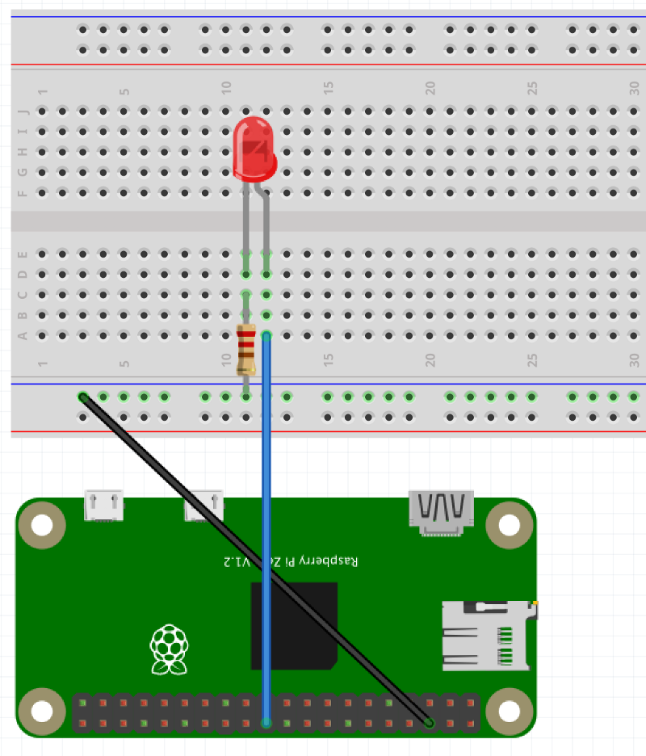
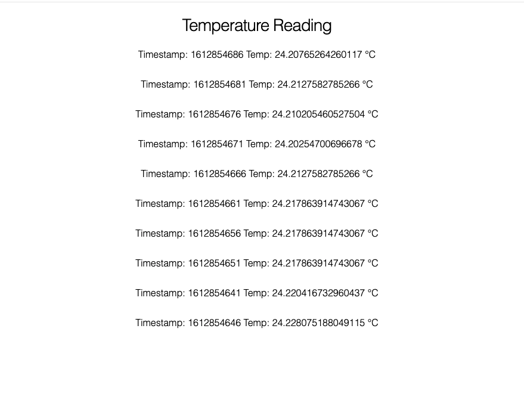

# Temp Sensor - Nerves Project

## Intro

The aim of this project is to learn more about interacting with sensors. I'm using Nerves which is a Framework, Tooling and Platform built in Elixir, which enables you to get up and running with IoT projects pretty quickly. It handles things like networking, creating a build for different devices, being able to update firmware.

I'm using a Bosch BME280 pressure/temp/humidity sensor with a Raspberry Pi Zero. With this library built by Frank Hunleth https://github.com/fhunleth/bmp280.

Outcomes:

- UI displaying latest temperature readings.
- Read and write temp data to device
- Trigger a GPIO port on and off based off a max temp being reached.

TODO:

- Update to use InfluxDB to persist data and use graph to visualise.
- Use pubsub instead of reading data at intervals.
- Update UI styling
- Add ability to update max temp, currently hardcoded.

## About

This project uses Phoenix Live View to display the temperature readings.

There are 2 processes that start up when the devices boots. 1 process handles reading from the sensor. The other process reads and writes the data to memory. To manage the data, currently temperatures are saved in memory to a queue, with a naive retention policy based on the number of items in the queue.

I'm using 2 GenServers (https://hexdocs.pm/elixir/GenServer.html) (sensor.ex, sensor_data.ex) to manage these processes.

The UI is handled using Phoenix LiveView. As i'm using live view we get a metrics dashboard for free. There is a link to this at the top of the UI, the dashboard will display things like current processes currently running on the device.

Currently temperatures are read from the sensor at 5 second intervals.

The view will read data from the memory in intervals and display as a list in the UI.

The sensor data is used to determine whether to trigger a GPIO port on or off, which port could be connected to a Solid State Relay which would trigger a heating/cooling element to be turned on or off. In this example i'm using an LED to indicate the port being triggered. There is a max temp of 21 hardcoded for now, when this temp is reached, the port is off, if under the port turns on.

## Hardware

Below is the hardware i'm using for this project. Any type of header can be used, i'm using a hammer header so I don't need to solder anything to the Pi Zero.

- Raspberry Pi Zero/Raspberry Pi Zero W
- Pi Zero Hammer Header
- BME280 Temperature sensor or BMP280 Temperature Sensor
- Red LED
- 330 ohm resistor
- Breadboard
- 6 male jumper cables

## Wiring Sensor with I2C

- Pi 3V3 to sensor VIN
- Pi GND to sensor GND
- Pi SCL to sensor SCK
- Pi SDA to sensor SDI


## Wiring for LED

This app will trigger GPIO port 18. The below image is an example. Ensure to plug the positive wiring to GPIO port 18.



## Install

1. Connect your Raspberry Pi Zero to your laptop via usb cable.
2. Prepare your Phoenix project to build JavaScript and CSS assets:

   ```bash
   # These steps only need to be done once.
   cd ui
   mix deps.get
   npm install --prefix assets
   ```

3. Build your assets and prepare them for deployment to the firmware:

   ```bash
   # Still in ui directory from the prior step.
   # These steps need to be repeated when you change JS or CSS files.
   npm install --prefix assets --production
   npm run deploy --prefix assets
   mix phx.digest
   ```

4. Change to the `firmware` app directory

   ```bash
   cd ../firmware
   ```

5. Specify your target and other environment variables as needed:

   ```bash
   export MIX_TARGET=rpi0
   ```

6. Get dependencies, build firmware, and burn it to an SD card:

   ```bash
   mix deps.get
   mix firmware
   mix firmware.burn
   ```

7. Insert the SD card into your Raspberry Pi board and connect the USB cable or otherwise power it on.
8. In your terminal ping nerves.local to see when it has finished booting. (approx 5 - 10 secs)
9. Wait for it to finish booting (5-10 seconds)
10. Open a browser window on your host computer to `http://nerves.local/`
11. You should see a screen displaying timestamps and temperature readings.
    

12. When temperature is below 21, LED will be triggered on. When temperature is above 21, LED is off.

## Troubleshooting

If your device is pingable but you are not seeing anything in the browser window. You can try the below steps.

### Check Logs

1. Open an iex session from the device.

   In your terminal run

   ```bash
   ssh nerves.local
   ```

2. This will open an iex session. Nerves provides RingLogger which enables us to view the logs from the device.

To see print all the messages from the log, run

```bash
RingLogger.next
```

To monitor logs, run

```bash
RingLogger.attach
```

If there is an issue with reading from the sensor, the below error will display.
If you receive this error, one thing you can try is to double check your wiring.

```bash
** (MatchError) no match of right hand side value: {:error, :i2c_nak}
    (bmp280 0.2.2) lib/bmp280.ex:191: BMP280.query_sensor/1
    (bmp280 0.2.2) lib/bmp280.ex:136: BMP280.handle_continue/2
    (stdlib 3.13.2) gen_server.erl:680: :gen_server.try_dispatch/4
    (stdlib 3.13.2) gen_server.erl:431: :gen_server.loop/7
    (stdlib 3.13.2) proc_lib.erl:226: :proc_lib.init_p_do_apply/3
```
